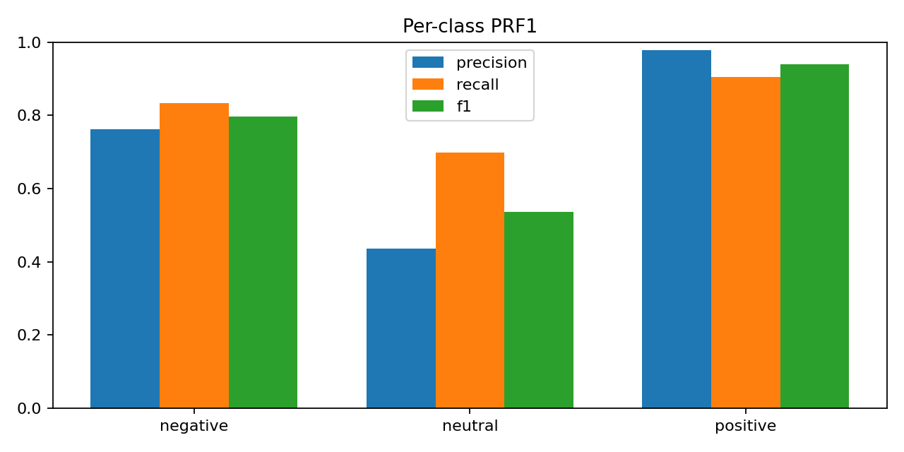

AspectSense — Aspect‑Based Review Miner (Windows)

AspectSense extracts aspects (e.g., LAPTOP#BATTERY, DISPLAY, SERVICE) from reviews and learns a sentiment classifier per aspect. It ships with:

A builder script that ingests your ABSA CSVs, cleans/normalizes them, trains a model, and saves artifacts.

A predictor script that loads the trained model and writes per‑file prediction CSVs (+ per‑class probabilities) and small JSON insights.

This README covers setup, paths, commands, artifacts, and troubleshooting—all tuned for your folders on Windows.

📂 Project files (from the canvas)

aspectsense_build.py — Build artifacts from your ABSA CSVs (train model).

aspectsense_predict.py — Predict polarity on any of the CSVs and save results.

Both scripts are Jupyter‑safe (parse_known_args) and also work from PowerShell/CMD.

📦 Requirements

Python 3.11 (Windows 10/11)

Install once in a virtual environment:

python -m venv .venv
.\.venv\Scripts\activate
pip install -U pip
pip install pandas numpy scikit-learn pyyaml joblib beautifulsoup4 html5lib

If running inside Jupyter and you see IProgress/tqdm warnings, you can optionally:

pip install ipywidgets
🗂️ Input data & output directory

Inputs (any subset can be present; missing files are skipped):

C:\Users\NXTWAVE\Downloads\Aspect Based Review Miner\archive\Laptop_Train_v2.csv
C:\Users\NXTWAVE\Downloads\Aspect Based Review Miner\archive\Laptops_Test_Data_PhaseA.csv
C:\Users\NXTWAVE\Downloads\Aspect Based Review Miner\archive\Laptops_Test_Data_PhaseB.csv
C:\Users\NXTWAVE\Downloads\Aspect Based Review Miner\archive\Restaurants_Test_Data_PhaseA.csv
C:\Users\NXTWAVE\Downloads\Aspect Based Review Miner\archive\Restaurants_Train_v2.csv
C:\Users\NXTWAVE\Downloads\Aspect Based Review Miner\archive\restaurants-trial.csv

Outputs (artifacts + predictions):

C:\Users\NXTWAVE\Downloads\Aspect Based Review Miner
🧪 Column mapping & normalization

Different ABSA CSVs use different headers. The scripts auto‑detect common names:

Text: text, Text, sentence, Review, reviewText, … → renamed to text

Category: category, AspectCategory, aspect, target, Aspect_Term, … → category

Polarity (train only): polarity, sentiment, label, Opinion → mapped to positive / negative / neutral

ID (optional): id, SentenceID, ReviewID, … → id

Additional normalization:

Categories upper‑cased & spaces → underscores (e.g., LAPTOP#BATTERY → LAPTOP#BATTERY, Delivery time → DELIVERY_TIME).

Text cleaning: remove HTML/URLs/punct, lowercase, collapse whitespace.

Feature for model = "[CATEGORY] " + cleaned_text to inject aspect context.

🚀 Build the model (train + export artifacts)

Script: aspectsense_build.py

# Activate env first
.\.venv\Scripts\activate

# Train on labeled rows in the provided CSVs and export artifacts
python "C:\Users\NXTWAVE\Downloads\Aspect Based Review Miner\aspectsense_build.py"

What gets saved to the output directory:

model_aspect_sentiment.pkl — scikit‑learn Pipeline (TF‑IDF + LogisticRegression, class_weight=balanced).

processed_absa.h5 — HDF5 store:

labeled (cleaned + predicted column for sanity check)

unlabeled (if any test files without polarity)

metrics_report.csv — full classification_report by class.

confusion_matrix.csv — confusion matrix (labels × labels).

eval_predictions_valid.csv — validation set predictions.

build_metadata.yaml — inputs, schemas, row counts, label distribution, model info.

insights.json — sentiment distribution + top negative categories snapshot.

Notes:

The builder skips duplicate files by (filename, size) signature.

Only rows with known polarity train the model.

If neutral is very small, the logistic regression still trains with class_weight=balanced.

🔮 Predict & save results (CSV → predictions)

Script: aspectsense_predict.py

# Use defaults (scores all existing CSVs in your archive folder)
python "C:\Users\NXTWAVE\Downloads\Aspect Based Review Miner\aspectsense_predict.py"

# Or specify explicit CSVs
python "C:\Users\NXTWAVE\Downloads\Aspect Based Review Miner\aspectsense_predict.py" `
  --files "C:\Users\NXTWAVE\Downloads\Aspect Based Review Miner\archive\Laptops_Test_Data_PhaseA.csv" `
          "C:\Users\NXTWAVE\Downloads\Aspect Based Review Miner\archive\Restaurants_Test_Data_PhaseA.csv"

Per input file outputs:

predictions_<basename>.csv — original columns + predicted_polarity, confidence, and (if available) proba_positive, proba_negative, proba_neutral.

insights_<basename>.json — quick distribution summary for that file.

If you scored multiple files: predictions_all.csv — concatenated outputs with __source__ column.

📊 Understanding the model

Feature extraction: TfidfVectorizer(max_features=100k, ngram_range=(1,2)) on "[CATEGORY] text".

Classifier: LogisticRegression(C=4.0, max_iter=300, class_weight='balanced').

Why this baseline? It’s robust, fast, and tends to work well on SemEval‑style ABSA with many categories and limited training data. You can later swap in transformer embeddings (e.g., sentence-transformers) if needed.

🧰 Typical workflow

Place/confirm your CSVs in the archive\ folder.

Run builder to train and export artifacts.

Run predictor to score test or new data files.

Inspect metrics_report.csv / confusion_matrix.csv and the prediction CSVs.

(Optional) Iterate: filter low‑quality rows, tweak TF‑IDF/C, and rebuild.

🛠️ Troubleshooting

“Model not found” when predicting
Run the builder first—model_aspect_sentiment.pkl must exist in the output folder.

“No text column found …”
Columns must include at least one of: text, Text, sentence, Review, reviewText.

Predictions look off for some categories
Ensure your test CSVs have a category/aspect column. If missing, the predictor assigns UNCAT, which weakens aspect context.

Jupyter argparse error (hidden -f flag)
Both scripts already use parse_known_args, so they ignore the Jupyter kernel flag. If you copy code elsewhere, keep that pattern.

Encoding issues reading CSV
The scripts retry with encoding='latin-1' when default UTF‑8 fails. If needed, open the CSV in Excel and re‑save as UTF‑8.

🧱 Extending the project

Per‑aspect summaries: aggregate top n‑grams or use a small LLM to generate pros/cons per category.

Trend charts: plot aspect sentiment share over time (requires a timestamp column).

Better embeddings: replace TF‑IDF with sentence-transformers (MiniLM) + linear classifier.

UI: add a small Gradio app that accepts a review + category and returns polarity with probabilities.

Model cards: export top features (highest TF‑IDF × LR coefficients) per class for explainability.
AUTHOR
SAGNIK PATRA
